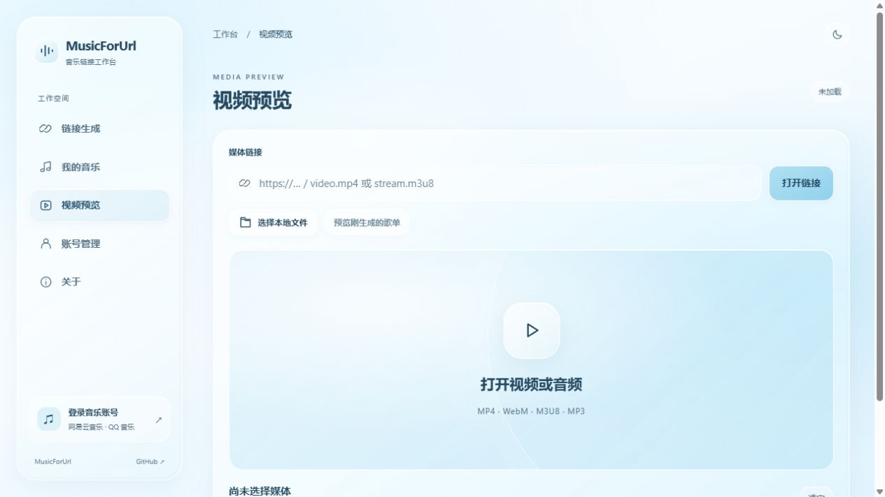

# MusicForUrl

将网易云音乐、QQ 音乐歌单转换为轻量音频 M3U8 播放链接，提供账号管理、音乐收藏和媒体预览。

当前版本使用 **Cloudflare Workers Static Assets + D1**，无需维护 VPS、Docker 或常驻 Node.js 服务。Cloudflare 代码位于 `codex/cloudflare-serverless` 分支，原 Node.js / Docker 版本的说明保留在 [README.node-docker.md](README.node-docker.md)。

**在线使用：[music.nyasakura.com](https://music.nyasakura.com/)**



## 功能与导航

| 入口 | 功能 |
| --- | --- |
| 链接生成 | 解析网易云 / QQ 音乐歌单，生成签名 M3U8 链接、复制链接并进入预览 |
| 我的音乐 | 浏览用户歌单、收藏和最近播放，支持平台切换与分页 |
| 视频预览 | 打开 HTTPS 媒体直链或本地视频 / 音频，支持 MP4、WebM、M3U8、MP3 等浏览器可解码格式 |
| 账号管理 | 查看两个平台的账号状态、账号 ID 与会员信息，选择常用平台、重新登录切换账号、退出登录，保存本机名称和备注 |
| 关于 | 查看项目介绍、构建版本、动画与播放库版本，以及项目和反馈入口 |

- 网易云支持扫码、手机验证码、密码和 Cookie 登录；QQ 音乐提供扫码登录。
- 每个平台保留一个当前登录账号。账号名称和备注按“平台 + 账号 ID”存储在当前浏览器，不修改音乐平台昵称，也不跨设备同步。
- 收藏、最近播放和服务端账号信息存入 D1；平台 Cookie 使用 AES-GCM 加密。
- 界面采用左侧导航与右侧内容区，主色为天蓝与白色，使用半透明玻璃容器；窄屏显示紧凑导航。
- 页面、Tab 滑块、列表、弹窗和按钮反馈统一使用 **GSAP**，支持系统的“减少动态效果”设置。实现位置与参数见[动画说明](cloudflare/ANIMATION.md)。

## 使用方式

1. 在“账号管理”或侧边栏底部登录音乐账号。
2. 在“链接生成”选择平台，输入歌单链接或 ID；也可以从“我的音乐”直接生成。
3. 复制生成的 M3U8 链接，或点击预览入口在本站播放。
4. “视频预览”也支持手动输入 HTTPS 媒体直链和选择本地文件。

本地文件仅通过浏览器 Object URL 预览，不上传到服务器。M3U8 优先使用本站打包的 Hls.js；不支持 MediaSource 的浏览器尝试原生 HLS。外部 HLS 源必须允许跨域请求。

## 播放与兼容性

Cloudflare 版本输出 **MP3 Packed Audio M3U8**：Worker 为音频添加 ID3 时间戳，并通过本站域名流式提供。每首歌作为一个完整片段，相邻歌曲使用 `EXT-X-DISCONTINUITY`；不进行 FFmpeg 转码，也不生成视频画面。实现细节见 [Cloudflare 文档](cloudflare/README.md#功能边界)与 [RFC 8216 第 3.4 节](https://www.rfc-editor.org/rfc/rfc8216.html#section-3.4)。

| 项目 | 当前边界 |
| --- | --- |
| 播放链接有效期 | 默认 24 小时，可配置至最多 48 小时；退出对应账号会撤销已生成链接 |
| 会员歌曲 | 取决于登录账号的权限、曲目可用性和音乐平台返回结果 |
| 视频输出 | Cloudflare 版不提供封面视频、随机背景视频、MP4 输出或 FFmpeg HLS 视频转码；预览页可播放已有视频直链 |
| 流量 | 音频经过 Worker；使用前应评估 Cloudflare 与上游平台的配额和限制 |
| VRChat | 浏览器播放成功不代表所有世界播放器可播放；还取决于播放器后端、允许域名和房间规则 |

VRChat 公开 / 群组公开房间需要世界作者将媒体域名加入 `Video Player Allowed Domains`，观众启用 `Allow Untrusted URLs`。将链接放入第三方播放器的 `?url=` 参数，不能保证该站支持转发或房间允许最终媒体域名。请参阅 [VRChat 官方规则](https://creators.vrchat.com/worlds/udon/video-players/www-whitelist/)。

## 本地开发

需要 **Node.js 24+**、npm 和 Git。以下示例使用 PowerShell：

```powershell
git clone --branch codex/cloudflare-serverless https://github.com/znc15/MusicForUrl.git
cd MusicForUrl/cloudflare
npm ci
Copy-Item .dev.vars.example .dev.vars
```

将 `.dev.vars` 中的 `ENCRYPTION_KEY` 替换为独立的至少 32 字符随机密钥，占位值会被拒绝。可以用下面的命令生成一个 64 字符十六进制密钥，再填入文件：

```powershell
node -e "console.log(require('node:crypto').randomBytes(32).toString('hex'))"
npm run db:local
npm run dev
```

按终端显示的本地地址访问。Wrangler 默认使用本地 D1 数据库；`npm run dev` 会先自动构建浏览器依赖和版本信息。

在另一个终端的 `cloudflare/` 目录运行回归测试：

```powershell
npm test
```

测试覆盖 Worker 认证与账号隔离、网易云播放接口、Packed Audio，以及工作台 URL 校验和账号偏好。

## 部署到 Cloudflare

此版本使用 **Workers Static Assets + Worker API + D1**，部署命令为 Wrangler；不能直接当作纯静态 Pages 项目上传。静态资源与 API 随同一个 Worker 发布，参考 [Cloudflare Static Assets 文档](https://developers.cloudflare.com/workers/static-assets/)。

以下步骤均在 `cloudflare/` 目录执行。

### 1. 登录并创建数据库

```powershell
npm ci
npx wrangler login
npx wrangler d1 create music-for-url
```

编辑 [cloudflare/wrangler.jsonc](cloudflare/wrangler.jsonc)：

- 将 `d1_databases[0].database_id` 替换为刚创建的 D1 ID，保留 `binding: "DB"`。
- **删除现有 `routes`，或替换为你自己的域名。仓库中的 `nyasakura.com` 路由属于在线站点。**
- 保留 `workers_dev: true`，首次部署可直接使用 Cloudflare 分配的 `workers.dev` 地址。
- 若修改 `database_name`，需要同步修改 `package.json` 中两个 `db:*` 命令使用的数据库名称。

然后初始化远端表：

```powershell
npm run db:remote
```

### 2. 配置密钥并首次发布

```powershell
Copy-Item .dev.vars.example .dev.vars.production
```

把 `.dev.vars.production` 中的 `ENCRYPTION_KEY` 换成独立生成的生产密钥，安全备份后执行：

```powershell
npm run build:assets
npx wrangler deploy --secrets-file .dev.vars.production
```

`.dev.vars`、`.dev.vars.production`、Wrangler 本地状态和运行数据均被 Git 忽略。不要提交真实 Cookie、登录令牌或生产密钥；丢失或直接更换加密密钥会使已有账号数据无法解密。

后续更新使用：

```powershell
npm run deploy
```

该命令自动构建静态依赖，并保留已有 Secret。部署后检查 `/api/health`，再验证登录、生成链接和预览播放。

### 3. 可选配置与自定义域名

| 配置 | 用途 | 默认值 |
| --- | --- | --- |
| `ENCRYPTION_KEY` | 账号加密与令牌签名；必须设为 Secret | 必填，至少 32 字符 |
| `TOKEN_TTL_HOURS` | 登录令牌有效期 | 168 小时 |
| `PLAYBACK_TOKEN_TTL_SECONDS` | 播放链接有效期 | 86400 秒，上限 172800 秒 |
| `CACHE_TTL` | 歌单缓存有效期 | 86400 秒 |
| `MUSIC_QUALITY` | `low / medium / high / lossless` 音质选择 | `low`；实际结果受账号与上游接口限制 |

自定义域名可配置为 Worker Custom Domain 或 Worker Route。当前在线站点的 Cloudflare for SaaS、DNS 优选和回退配置见[站点部署记录](cloudflare/README.md#域名证书和优选入口)，这些记录仅供参考；优选目标的可用性和访问效果会随网络变化。

## 项目结构

```text
cloudflare/
  src/                 Worker API、网易云适配、认证和音频流处理
  schema.sql           D1 表结构
  scripts/             同步 GSAP、Hls.js 与构建版本信息
  tests/               Cloudflare 版本回归测试
  wrangler.jsonc       Worker、静态资源、D1 与域名配置
public/
  views/               链接生成、音乐、预览、账号、关于页面
  includes/            侧边栏、登录弹窗等公共模板
  js/main.js           路由与音乐业务
  js/workspace.js      导航、账号偏好与媒体预览
  js/motion.js         统一 GSAP 动画
  js/vendor/           本站托管的浏览器依赖
lib/qqmusic.js          QQ 音乐适配
server.js / routes/     保留的 Node.js 服务端
deploy/                保留的 Docker 部署文件
```

旧版 SQLite 数据不会自动迁移到 D1，需要重新登录；收藏和最近播放从新数据库开始。平台接口可能随上游更新或风控变化而失效。

## 文档与反馈

- [Cloudflare 实现与站点部署记录](cloudflare/README.md)
- [动画实现、时长与复用示例](cloudflare/ANIMATION.md)
- [Node.js / Docker 旧版部署说明](README.node-docker.md)
- [问题反馈](https://github.com/znc15/MusicForUrl/issues)

## License

项目代码采用 [MIT License](LICENSE)。第三方库遵循各自许可，仓库保留其许可声明。